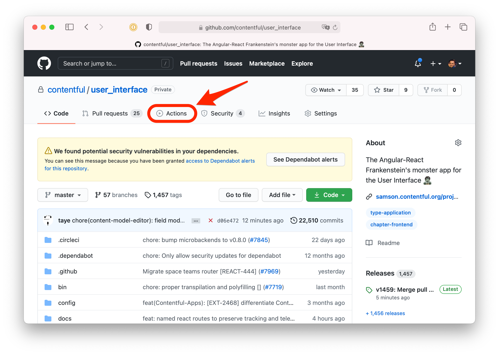
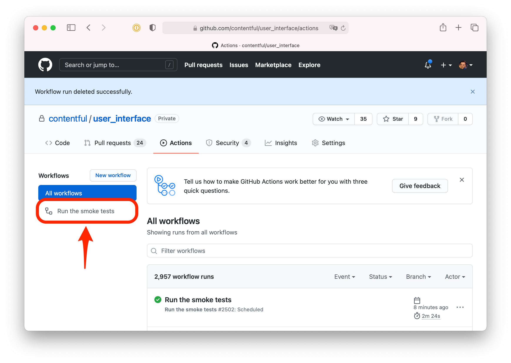
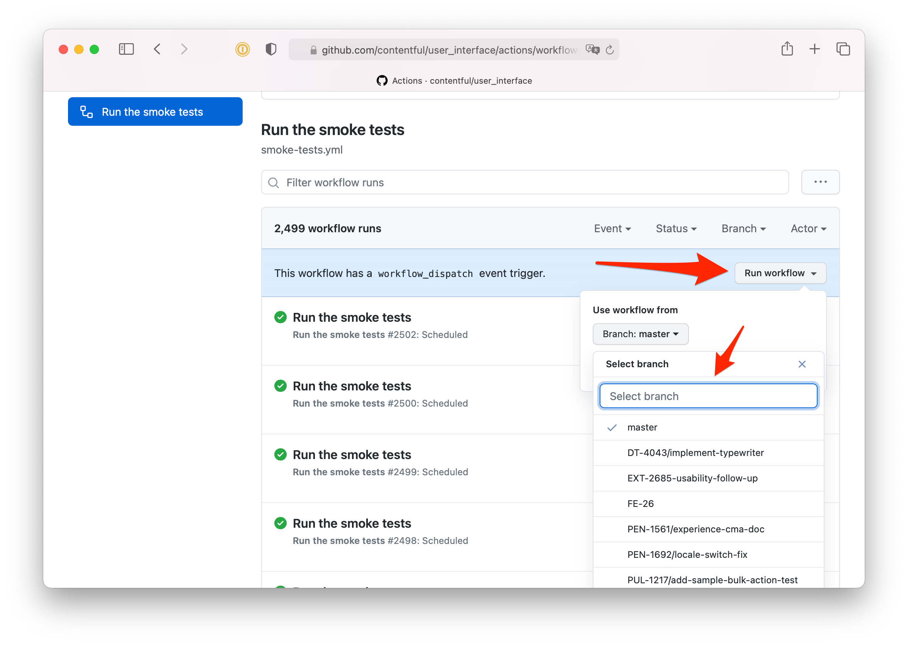
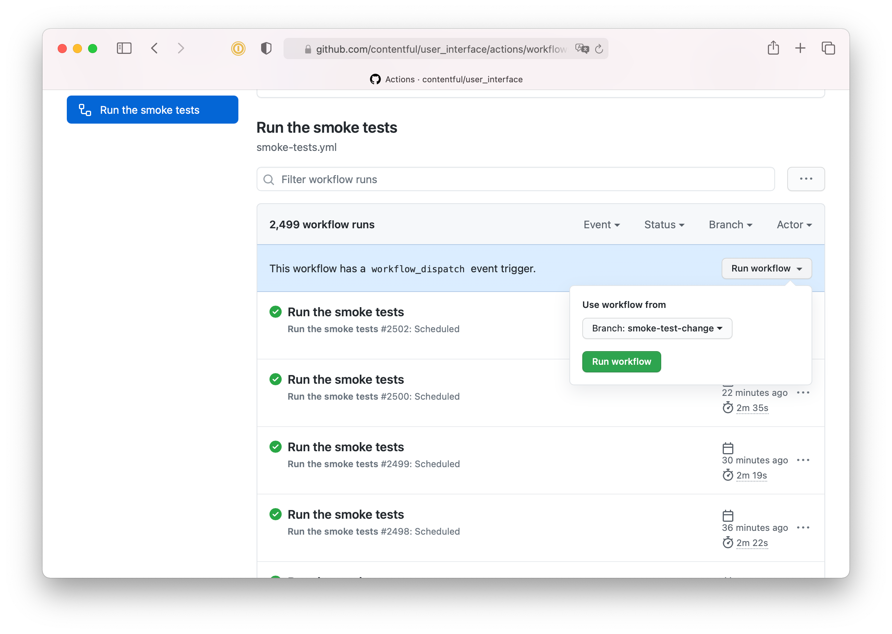
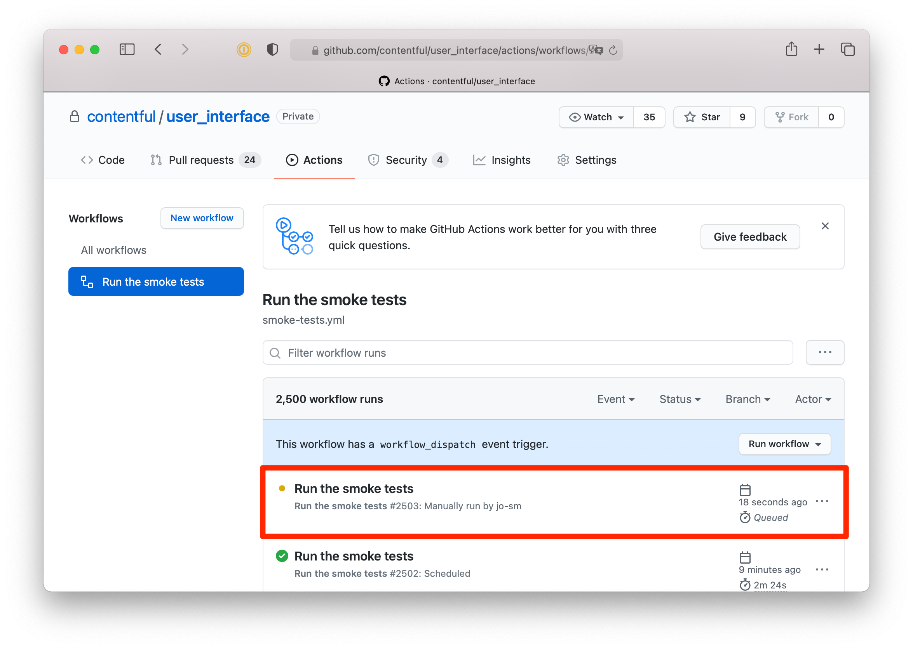

# Smoke tests

Our smoke tests are used for testing critical functionality (critical paths) of the web app.

For high level information, please see the Confluence pages on [the critical paths](https://contentful.atlassian.net/wiki/spaces/ENG/pages/2785312930) and [smoke tests](https://contentful.atlassian.net/wiki/spaces/ENG/pages/2794029205).

# Smoke tests in the CI

To ensure that we regularly monitor the web app for changes that might disrupt the critical paths, the smoke tests run roughly [every 7 minutes in a Github Actions workflow](https://github.com/contentful/user_interface/blob/b33fbdf404a17113d5ea925a2903480fa6bef714/.github/workflows/smoke-tests.yml). You can view individual smoke test runs in the [Github Actions interface](https://github.com/contentful/user_interface/actions/workflows/smoke-tests.yml).

## Running a change to the smoke test setup

If you make a change to the smoke tests, either the workflow, a test, telemetry, etc., it's best to test it in the CI to ensure that it works as expected.

To do this, first push your branch to Github. You don't need to open a PR.

Go to the [Actions](https://github.com/contentful/user_interface/actions) section of the repo:



Click on the **Run the smoke tests** workflow item:



Click on the **Run workflow** dropbown button, and select the branch you want from the list:



If it doesn't appear, double check that your branch is pushed to Github.

After selecting the branch, click the green **Run workflow** button:



The run will shortly appear in the list:



<!--
TODO(jo-sm): uncomment this when we are able to run the tests against a specific ui_version.

## Manually triggering a smoke test run

If you have a change in your branch that you're worried may affect the smoke tests, you can manually trigger a smoke test run against your branch. To do so, go to the Github Actions interface:

(screenshot TBA)

Click on the **Run the smoke tests** workflow:

(screenshot TBA)

On this page you should see a **Run workflow** dropdown button. Click on this and select the branch you want to test against, then click the green **Run workflow** button:

(screenshot TBA)

This manually triggered run will shortly appear in the list and you can monitor the results live by clicking on the newly created list item and then clicking on the **Run tests** job:

(screenshot TBA)
 -->

# Running smoke tests locally

To run the smoke tests locally, you'll need the password and email for the account used for testing. By default the email is set to `test@contentful.com`, so if you're using this account, you only need to provide the password using the environment variable `SMOKE_TEST_USER_PASSWORD`. This password is available in 1Password. If you don't set the password Cypress will err and tell you what the problem is.

You will also need to either provide a Librato auth token using the `LIBRATO_AUTH_TOKEN` environment variable, or alternatively setting the `SKIP_LIBRATO` environment variable. Without doing one of these Cypress will err.

The simplest way to run the smoke tests is using the `npm` task:

```
export SMOKE_TEST_USER_PASSWORD="..."
export LIBRATO_AUTH_TOKEN="..."
# or...
export SKIP_LIBRATO="true"

npm run smoke # runs against contentful.com
npm run smoke-staging # runs against flinkly.com
```

## Running against a different domain

If you'd like to run against a different domain, like `quirely.com`, you can run the following command from the project root:

```
SMOKE_TEST_DOMAIN='quirely.com' npm run smoke
```

**Please note** that the account you use must not have 2FA enabled, or else the tests will fail.

# Telemetry and Librato

At the moment we use Librato for telemetry. If you don't have an account, please request one from IT.

## Test telemetry setup

The basic telemetry - if a specific test case passes or fails - is automatically handled with [`tools/bin/report-smoke-test-telemetry.ts`](https://github.com/contentful/user_interface/blob/master/tools/bin/report-smoke-test-telemetry.ts).

In addition to the automatic telemetry setup, you can also track the duration of something specific using [`wrapWithDuration`](https://github.com/contentful/user_interface/blob/master/test/smoke/telemetry.ts#L77-L89):

```typescript
test('my-spec', () => {
  const page = wrapWithDuration<Page>('my-metric', () => {
    page.doSomething();

    some.container.should('be.visible');

    return page;
  });
});
```

For more details, please see [the documentation for `wrapWithDuration`](https://github.com/contentful/user_interface/blob/master/test/smoke/telemetry.ts#L56-L76).

## Metrics and the dashboard

All metrics are namespaced under `web-app-smoke-tests`, e.g. `web-app-smoke-tests.some-metric`. All metrics are tagged with the environment, e.g. `production`, `staging`.

The main metric, the success/failure of a test, is the metric `web-app-smoke-tests.testcase-success`, and each individual test gets its own tag for the name of the test case. An example JSON payload to Librato looks like this:

```json
{
  "name": "web-app-smoke-tests.testcase-success",
  "value": 1,
  "tags": {
    "testName": "space-creation",
    "environment": "production"
  }
}
```

Other metrics may exist (for example, `time-login-to-space-home`). These metrics are currently only tagged with the environment and their value. Please see the metrics list in Librato for a complete list.

You can see a high level view on the dashboard, [located here](https://metrics.librato.com/s/spaces/1309245). You can also search for the name _Web app smoke tests_ in Librato.

## Alerts

Alerts are also setup in Librato, and should have, like the metrics, the `web-app-smoke-tests` namespace. At the moment, there are alerts setup for the login and space creation smoke tests, for both staging and production. As more tests are added, more alerts will be added.

At the moment, the alerts ping just Slack, but long term they will be setup to page the Frontend on-call person.

# Smoke test spec best practices

## Spec naming and its importance w.r.t. telemetry

The name of the spec is very important, as it used for reporting data to Librato for telemetry purposes. **Always name the test using hyphen case**. It's also highly recommended not to nest tests within a describe block and to just use the `test` global.

```typescript
test('some-smoke-test-name-like-login', () => {
  // ...
});
```

## Page objects

Page objects allow us to encapsulate pages (and general components shared across the app, like the nav bar) in reusable pieces to make it easier to reason about the tests and to work with the specs themselves. Explained another way, they allow the tests to be more declarative, meaning the specific implementation of how we interface with a page isn't described directly in the tests.

Below is a set of best practices when dealing with page objects and the way you should think about them when working on the smoke tests.

### Getter vs non-getter methods

In your page object, you should generally prefer to use getter methods for things like querying elements, and regular methods for things that have some kind of side effect or do something other than just return something on the page:

```typescript
class LoginPage {
  // Use a getter to return the field
  get passwordField() {
    return cy.get('#user_password');
  }

  // Since this has a side effect (returning a new page object), don't use a getter
  submitForm() {
    cy.get('input[type="submit"]').click();

    return new SpaceHomePage();
  }
}
```

### Element querying

You _should never_ query for an element on the page directly in the test specs, as this makes maintaining the tests and quickly reacting to changes more challenging. Instead, you should _always_ use a page object property or method:

```typescript
it('should successfully input some test', () => {
  // Do not do this
  const textField = cy.findByTestId('my-cool-text-field');
  textField.type('some text');

  // Do this instead
  pageObject.textField.type('some text');
});
```

That said, you should keep the assertions in the spec itself and not in the page object:

### Interfacing with page objects

The same principle as above applies for methods that may have side effects. You should generally always handle any side effect in a method on the page object, rather than in the spec itself. For example, if you need to return a new page object, you should return it from a method, rather than instantiating it in the test spec itself:

```typescript
it('should open a modal', () => {
  // Do not do this
  cy.findByTestId('cta-button').click();

  cy.findByTestId('modal-container').should('be.visible');

  // Do this instead
  const modal = page.openCTA();
  modal.container.should('be.visible');
});
```

The above example illustrates three points:

1. Those methods should return a new page object (or other result), rather than instantiating in the test itself.
2. Your methods should describe the action the user would take in general terms (declaratively written), hiding the specific implementation from the spec.
3. Page objects may not necessarily be a whole page. It may be a part of a page.

### Practical example: Initially visiting a page

Since you aren't supposed to instantiate a page object directly, how should you set up your page object such that it allows you to "visit" a page? For example, in our login test, we need to visit `https://be.contentful.com/login` before doing anything else -- how do we do that while preserving the above principles?

Since page objects are classes, you can utilize a static method to accomplish this.

```typescript
class LoginPage {
  static visit() {
    cy.visit(`https://be.${Cypress.env('domain')}/login`);

    return new LoginPage();
  }
}

it('should visit the login page', () => {
  const loginPage = LoginPage.visit();
});
```

### Practical example: Putting it all together

Applying the above principles together, we can write the web app login test:

```typescript
class SpaceHomePage {
  get container() {
    return cy.findByTestId('space-home-container');
  }
}

class LoginPage {
  static visit() {
    cy.visit(`https://be.${Cypress.env('domain')}/login`);

    return new LoginPage();
  }

  get emailField() {
    return cy.get('#email_field');
  }

  get passwordField() {
    return cy.get('#password_field');
  }

  submitForm() {
    cy.get('#submit_button').click();

    return new SpaceHomePage();
  }
}

it('should login successfully', () => {
  const loginPage = LoginPage.visit();
  loginPage.emailField.type('test@example.com');
  loginPage.passwordField.type('password123');

  const spaceHome = loginPage.submitForm();

  spaceHome.container.should('be.visible');
});
```
